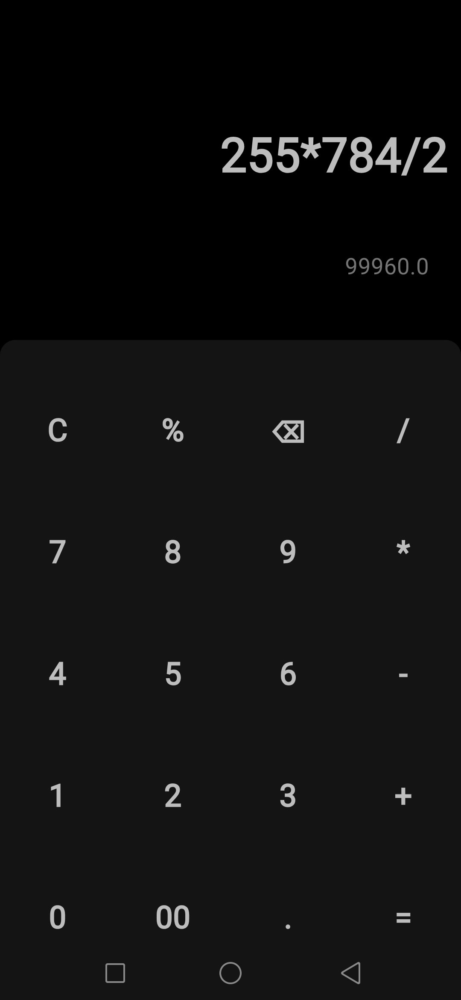

# Numbra

Numbra is a simple and intuitive calculator app built using Flutter. It provides basic arithmetic operations with a clean and user-friendly interface.

## Features

- Basic arithmetic operations: addition, subtraction, multiplication, division
- Responsive and clean user interface

## Screenshots




## Getting Started

### Prerequisites

Before you begin, ensure you have met the following requirements:

- You have installed Flutter and Dart on your local machine. You can download them from [here](https://flutter.dev/docs/get-started/install).

### Installation

To install and run Numbra, follow these steps:

1. Clone the repository:

    ```bash
    git clone https://github.com/CrayFish0/numbra.git
    ```

2. Navigate to the project directory:

    ```bash
    cd numbra
    ```

3. Get the required dependencies:

    ```bash
    flutter pub get
    ```

4. Run the app:

    ```bash
    flutter run
    ```

## Usage

1. Open the Numbra app on your device/emulator.
2. Use the on-screen buttons to perform calculations.

## Contributing

Contributions are always welcome! Please follow these steps:

1. Fork the repository.
2. Create a new branch:

    ```bash
    git checkout -b feature/your-feature-name
    ```

3. Make your changes and commit them:

    ```bash
    git commit -m 'Add some feature'
    ```

4. Push to the branch:

    ```bash
    git push origin feature/your-feature-name
    ```

5. Open a pull request.

## License

This project is licensed under the MIT License - see the [LICENSE](LICENSE) file for details.

## Contact

If you have any questions or suggestions, feel free to reach out to the project maintainers at [cray.fish.75.02@gmail.com](mailto:cray.fish.75.02@gmail.com).

---

Made with ❤️ using Flutter.
